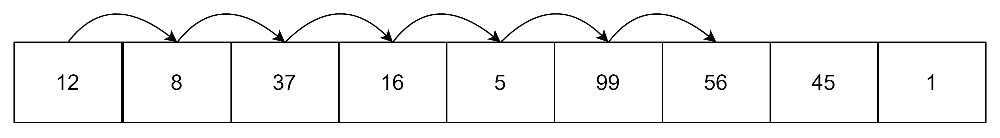

# линейный поиск

Линейный поиск (называемый также _последовательный поиск_) является простейшим алгоритмом, перебирающим последовательно все элементы. Этот алгоритм неэффективен (сложность _О(N)_), однако единственно возможный в случае неупорядоченных данных. Если же у вас есть большие объёмы данных, удобнее будет эти данные предварительно отсортировать, а потом воспользоваться каким-либо другим алгоритмом поиска.

Линейный поиск представляется следующим алгоритмом:

1. _дано:_  __A__ - массив объектов, объект __p__.
   _найти:_ индекс __i__ объекта __p__ в массиве. 
2. __пусть__ __size__ - количество элементов в массиве.
3. __пусть__ i = 0
4. __пока__ i < size __повторять:__
   1. __если__ A[i] == p __то:__ вывести i; __выйти\_из\_цикла__
   2. i := i+1

Если у нас дан массив `[12, 8, 37, 16, 5, 99, 56, 45, 1]` и мы ищем значение `56`, то поиск будет выглядеть следующим образом:



Пример реализации на `С++`:

```cpp
template<typename Type>
size_t linear_search(Type* array, size_t size, Type value) {
    size_t index = 0;
    while(index < size) {
        if(array[index] == value) {
            return index;
        }
        ++ index;
    }
    return index;
}
```
