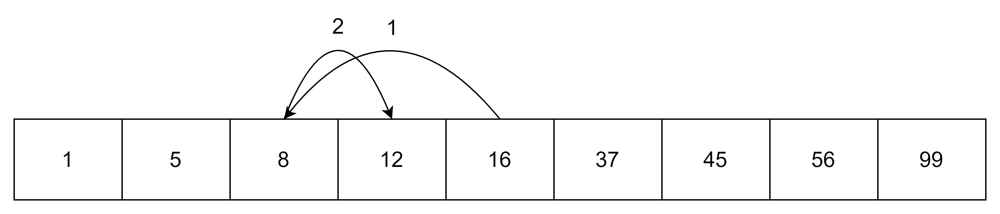

# двоичный поиск

_Двоичный поиск_, известный также как _бинарный поиск_, классический алгоритм поиска элемента в отсортированном массиве (векторе), использующий дробление массива на половины. Является адаптацией _метода деления отрезка пополам_[^1]

Двоичный поиск можно применять только на отсортированной линейной структуре данных.

Если у нас дан массив `[1, 5, 8, 12, 16, 37, 45, 59, 99]` и мы ищем значение `12`, то поиск будет выглядеть следующим образом:



Пример кода на С++:

```cpp
template<typename Type>
size_t binary_search(Type* array, size_t size, Type value) {
    size_t left = 0;
    size_t right = size;
    while(left < right) {
        size_t middle = (left + right) / 2;
        if(array[middle] == value) {
            return middle;
        }
        if(array[middle] < value) {
            left = middle + 1;
        }
        else {
            right = middle;
        }
    }
    return size;
}
```

```cpp

template<typename iterator, typename type>
iterator binary_search(iterator begin, iterator end, type value) {
    while( begin < end) {
        iterator middle = begin + (end - begin) / 2;
        if(*middle == value) {
            return middle;
        }
        if(*middle < value) {
            begin = middle + 1;
        }
        else {
            end = middle;
        }

    }
}
```

[^1]: [WIKI Метод деления отрезка пополам](https://ru.wikipedia.org/wiki/Метод_бисекции)